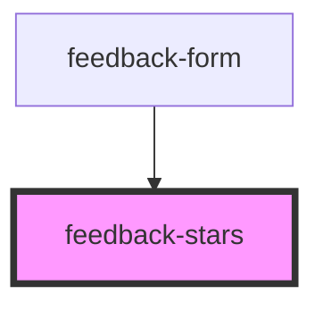

# feedback-stars
Web Component that shows the ranking using stars to represent it from 0 to 5 

<!-- Auto Generated Below -->

## Properties

| Property | Attribute | Description | Type     | Default |
| -------- | --------- | ----------- | -------- | ------- |
| `rating` | `rating`  | 0-5 ranking | `number` | `0`     |

## Events

| Event         | Description | Type                  |
| ------------- | ----------- | --------------------- |
| `rateArticle` | trigger the rate has picked | `CustomEvent<number>` |

## Dependencies

### Used by

 - [feedback-form](../feedback-form)

### Graph

----------------------------------------------

*Built with [StencilJS](https://stenciljs.com/)*
