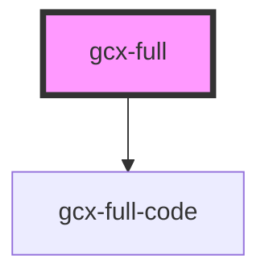

# gcx-full

Web component that shows two columns template, one for the explanations and another for code.
This component uses `:page-layout: gcx-full` to show the content of the pages in two columns.

## Way to use

This component uses two keys to determinate wich type of content shall it display:

`[.gcx-hook-*='code lines']` This block was assigned for the explanation content, which is composed by:

- Name of key: `*`, you can use it to identify different segments of code in the page.
  For example _API-TO-CONNEC-DB_, _HOW-TO-REQUEST-XYZ_, _CREATE-LIST-OF-OBJECT_, and must be followed by the next one.

- code lines: those lines will be focus when the user clicks this segment explanation.
  The code lines can be separate by a comma or an line exmaple ['1,2,3'] or ['1-10']

Here are some proper ways to use it

```asccidoc
[.gcx-hook-api01='110-145']
== Title
Lorem ipsum dolor sit amet, consectetur adipiscing elit.

[.gcx-hook-read-json-file='1,2,3']
== Title
Lorem ipsum dolor sit amet, consectetur adipiscing elit.

[.gcx-hook-connect-to-db='1-20']
== Title
Lorem ipsum dolor sit amet, consectetur adipiscing elit.
```

Let's take a look about the code segments.

`[.gcx-code-*]` This block was assigned for the code content, which is composed by:

- name of key: `*`, you must use it to identify the segment code, which has been used by the segment explanation `gcx-hook`.
  for example _API-TO-CONNEC-DB_, _HOW-TO-REQUEST-XYZ_, _CREATE-LIST-OF-OBJECT_.

Accordint to last examples here are some proper ways to use it

```asccidoc
[.gcx-code-api01]
navigator.geolocation.getCurrentPosition(function(position) {
  var latlng = new google.maps.LatLng(position.coords.latitude,position.coords.longitude);
  var myOptions = {
    zoom: 8,
    center: latlng,
    mapTypeId: google.maps.MapTypeId.TERRAIN,
    disableDefaultUI: true
  }
  var map = new google.maps.Map(document.querySelector("#map_canvas"), myOptions);
});

[.gcx-code-read-json-file]
 var mydata = JSON.parse('myjson.json');
  alert(mydata[0].name);
  alert(mydata[0].age);
  alert(mydata[1].name);
  alert(mydata[1].age);


[.gcx-code-connect-to-db]
 var mysql = require('mysql');

var con = mysql.createConnection({
  host: "localhost",
  user: "yourusername",
  password: "yourpassword"
});

con.connect(function(err) {
  if (err) throw err;
  console.log("Connected!");
});
```

`gcx-hook` can be uses many times for only one `gcx-code` segment for covering different explanations in the code.

<!-- Auto Generated Below -->


## Properties

| Property         | Attribute         | Description | Type     | Default     |
| ---------------- | ----------------- | ----------- | -------- | ----------- |
| `templateScript` | `template-script` |             | `string` | `undefined` |


## Events

| Event           | Description | Type               |
| --------------- | ----------- | ------------------ |
| `linesSelected` |             | `CustomEvent<any>` |


## Dependencies

### Depends on

- [gcx-full-code](../gcx-full-code)

### Graph


----------------------------------------------

*Built with [StencilJS](https://stenciljs.com/)*
